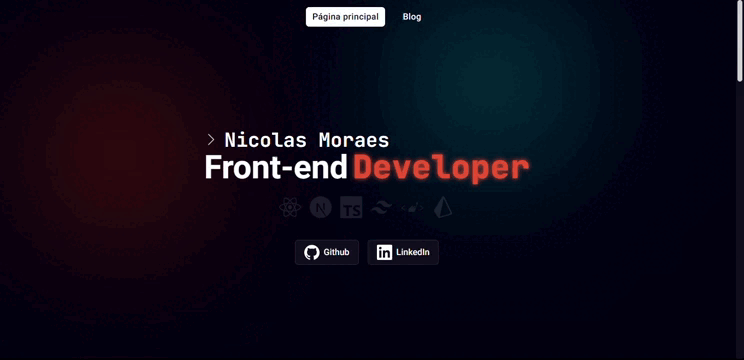

# Site Portfólio/Blog
O site tem como propósito ser um espaço onde eu possa compartilhar meu conhecimento e experiência em tecnologia, ocasionalmente publicando postagens relacionadas a tecnologias que uso ou estou aprendendo.

## Preview

* **Framework**: [Next.js](https://nextjs.org/)
* **Gerenciamento de conteúdo**: [DatoCMS](https://www.datocms.com/)
* **Deployment**: [Vercel](https://vercel.com/home)
* **Estilização**: [TailwindCSS](https://tailwindcss.com/)

## TODO
- [ ]  **Botão de voltar ao topo**: Adicionar um botão para que o usuário possa facilmente voltar ao topo da página sem precisar rolar até o início.

- [ ]  **Seção de recomendação**: Adicionar uma seção ao final de cada post com recomendações de outros artigos relacionados.
